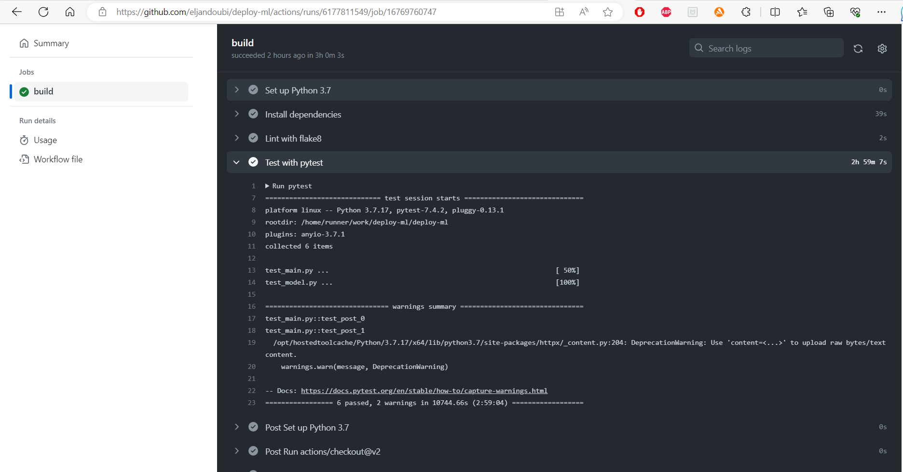
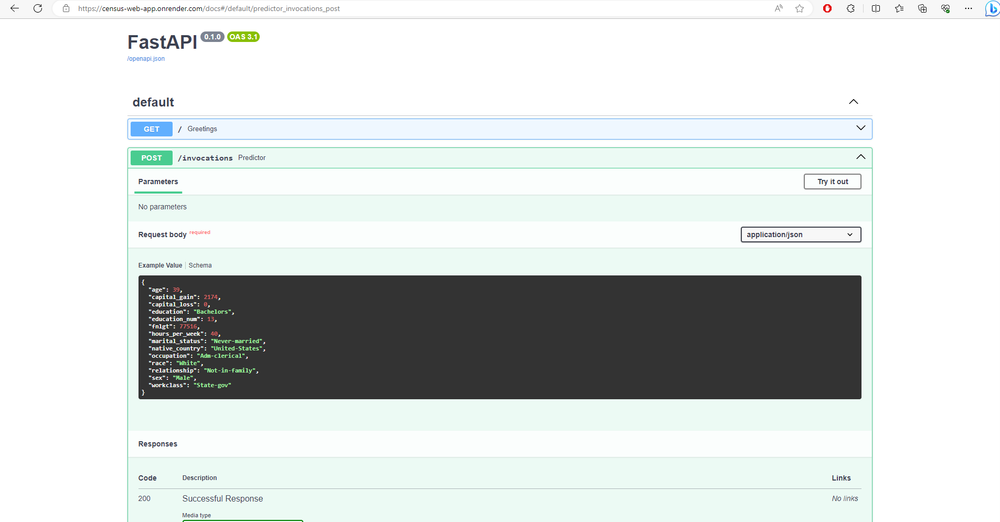

# Project Overview
The Objective is to deploy a ML model with FastAPI on Render.


The project follows these steps:
- Train a ML model on a classification task to predict salary group of individuals based on 14 various characteristics. The threshold salary used is $50,000. You can refer for the detailed modelCard [here](https://github.com/eljandoubi/deploy-ml/blob/main/model_card_template.md ) for details on the model and dataset used
- Implement Continuous Integration / Continuous Deployment workflow using Github actions, github repository and Heroku integration with Github. The app is only deployed if integrated, automated, tests are validated by Github actions upon modifications
- Expose the model for inference using a FastAPI app
- Deploy the app using Render to provide inference endpoint

# Environment Set up
* Download and install conda if you don’t have it already.
    * conda create -n [envname] python=3.7
    * conda activate [envname]
    * Install git either through conda (“conda install git”) or through your CLI, e.g. sudo apt-get git.
    * pip install -r requirements.txt
* Get the repository
    * Clone the repository ```git clone https://github.com/eljandoubi/deploy-ml.git```
    * Move to folder ```cd deploy-ml```
    
# Using the API client
* main.py app is deployed to Render from github repo with CI/CD enabled. Automatic deployments are performed only if Github actions continuous integration validation passes
* Key files required by Render: requirements.txt, python scripts, saved models.
* Navigate to logs to follow the deployement process.
* Inference can be performed using the dedicated script "request.py". The script posts a sample item (14 features) to the app url/invocations and the prediction is returned. The inference is performed by the main.py module using the trained pipeline saved in the ./model folder
* See the screenshots as illustrations [here](https://github.com/eljandoubi/deploy-ml/tree/main/screenshots )
 
 - CI/CD Github actions validation
 

 - inference FastAPI
 
 
 - inference output from endpoint
  


No external storage was necessary due to the dataset and model's light weights. External storage with Azure blob together with DVC for versioning could be implemented depending on the use case and the weight of these two major components.
                                     
This the URL of API : [census web app](https://census-web-app.onrender.com ) It may be unavailable by the time you read this.
  